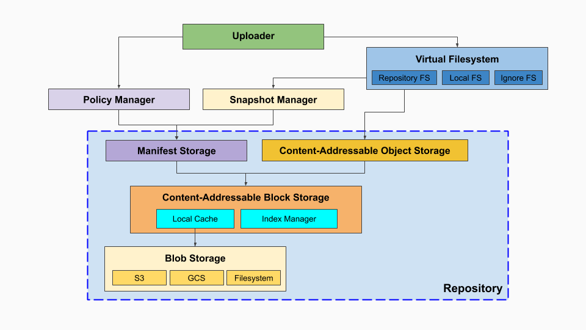

Kopia stores its data in a data structure called Repository. 

Repository adapts simple storage such as NAS filesystem, Google Cloud Storage or Amazon S3 to add features such as encryption, deduplication, content-addressability and ability to maintain rich snapshot history.

Repository codebase is maintained in a stand-alone GitHub project at https://github.com/kopia/repo, separate from Kopia command-line tool and can be used for any purpose.

The following diagram illustrates the key components of Kopia:



### Binary Large Object Storage (BLOB)

BLOB storage is the place where your data is ultimately stored. Any type that implements simple Go [API](https://godoc.org/github.com/kopia/repo/storage#Storage) can be used as Kopia's blob storage.

Kopia currently supports the following storage providers:

* Google Cloud Storage
* Amazon S3 or compatible
* Filesystem (local or remote)
* WebDAV

Cloud storage solutions are a great choice because they provide high availability and durability of data at a very reasonable price.

Kopia does not require low-latency storage, it uses caching and other optimizations to be able to work efficiently with high-latency backends.

The API for BLOB storage can be found in https://godoc.org/github.com/kopia/repo/storage

### Content-Addressable Block Storage (CABS)

BLOB storage by itself does not provide the features that Kopia needs (encryption, de-duplication), so we're usign content-addressable block storage layer to add those key features.

Content-Addressable Block Storage manages data blocks of relatively small sizes (typically <=20MB). Unlike BLOB storage where we can freely pick a filename, CABS assigns an identifier called **Block ID** to each block of data that gets stored.

Block ID is generated by applying [cryptographic hash function](https://en.wikipedia.org/wiki/Cryptographic_hash_function) such as SHA2 or BLAKE2S to produce a pseudo-random identifier, such as `6a9fc3a464a79360269e20b88cef629a`. 

A key property of block identifiers is that two identical block of data will produce exactly the same identifiers, thus resulting in natural de-duplication of data.

After hashing, the block data is encrypted using algorithm such as `AES256-CTR` or `SALSA20`. To make uploads to cloud storage more efficient and cheaper, multiple smaller blocks are combined into larger **Packs** of 20-40MB each. 

To help efficiently find a block in the blob storage, CABS maintains an index that maps block ID to the blob file name, offset within the file and length.

Pack files in blob storage have random names and don't reveal anything about their contents or structure. Their sizes are also generally unrelated to content due to splitting and merging.

CABS is not meant to be used directly, instead it's a building block for object storage (CAOS) and manifest storage layers (LAMS) described below.

The API for CABS can be found in https://godoc.org/github.com/kopia/repo/block

### Content-Addressable Object Storage (CAOS)

Content-Addressable Object Storage allows storing binary objects of arbitrary sizes. Small objects are stored directly as individual CABS blocks, but larger objects need to be split into many smaller blocks before they can be stored.

**Object IDs** represent CAOS objects and are similar to Block IDs in that they are derived from object data. In fact for small blocks they are both identical: every valid Block ID is also valid Object ID representing the same contents.

Object IDs can also have an optional single-letter prefix `g..z` that helps quickly identify its type:

* `k` represents directory listing (e.g. `kfed1b0498dc54d07cd69f272fb347ca3`)
* `m` represents manifest block (e.g. `m0bf4da00801bd8c6ecfb66cffa67f32c`)
* `h` represents hash-cache (e.g. `h2e88080490a83c4b1cb344d861a3f537`)

To represent objects larger than the size of a single CABS block, Kopia links together multiple blocks via special indirect JSON block. Such blocks are distinguished from regular blocks by the `I` prefix. For example very large hash-cache object might have an identifier such as `Ih746f0a60f744d0a69e397a6128356331` and JSON content:

```json
{"stream":"kopia:indirect","entries":[
  {"l":9076851,"o":"2fc5ac219af279579366d87029d682ea"},
  {"s":9076851,"l":6138016,"o":"107572665e69114d22cd43547ac1b33d"}
]}
```

The API for CAOS can be found in https://godoc.org/github.com/kopia/repo/object

### Label-Addressable Manifest Storage (LAMS)

While content-addressable storage is a neat idea, dealing with cryptographic hashes its not very convenient for humans to use.

To address that, Kopia supports another type of storage, used to persist small JSON objects called **Manifests** (describing snapshots, policies, etc.) which are identified by arbitrary `key=value` pairs called labels.

Internally manifests are stored as CABS blocks.

The API for LAMS can be found in https://godoc.org/github.com/kopia/repo/manifest

